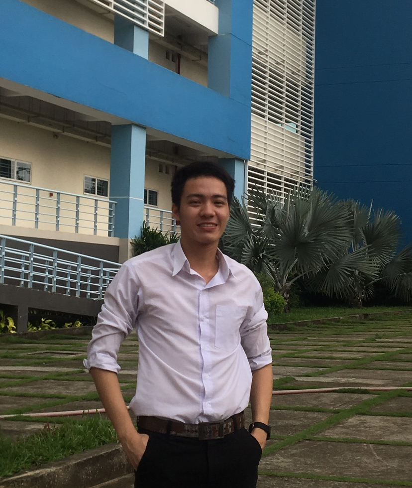

    

        

            Software Engineer 
        

        

            Computer Science & Engineering 
            Ho Chi Minh City University of Technology 
        

        

            <a href="mailto:quytn.cs@gmail.com">quytn.cs@gmail.com</a> 
            [<a href="assets/CV.pdf">CV</a>]
            [<a href="https://github.com/motmaytinh">GitHub</a>]
            [<a href="https://twitter.com/motmaytinh">Twitter</a>]
            [<a href="https://facebook.com/motmaytinh">Facebook</a>]
            [<a href="https://www.linkedin.com/in/quytn">LinkedIn</a>]
             
        

    

    

        
    

---

Hi, I am a fourth-year B.E student in Computer Science at Ho Chi Minh University of Technology. I am particularly enthusiastic in exploring NLP and ML techniques to solve realworld problems relating to language technologies.

I am a software engineer at Zalo.

---

## Personal

I like making friends with people around the world; photography; reading books; listening to instrumental music.

Take a look at my photos <a href="https://myalbum.com/embed/7KAjl6f3h9dS">here</a>